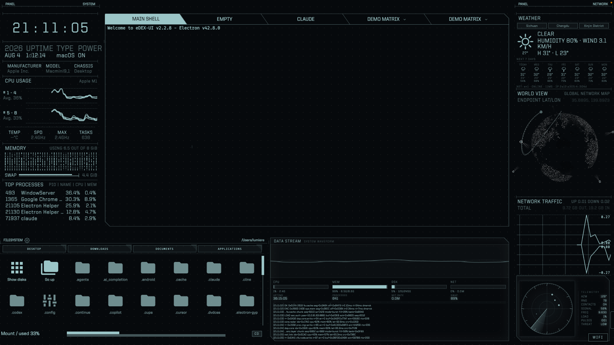
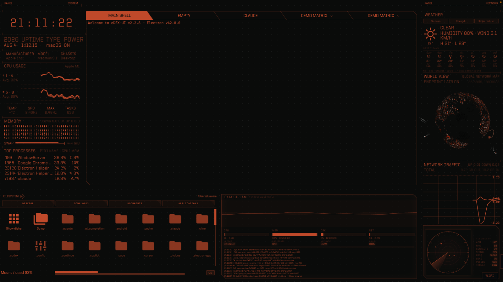
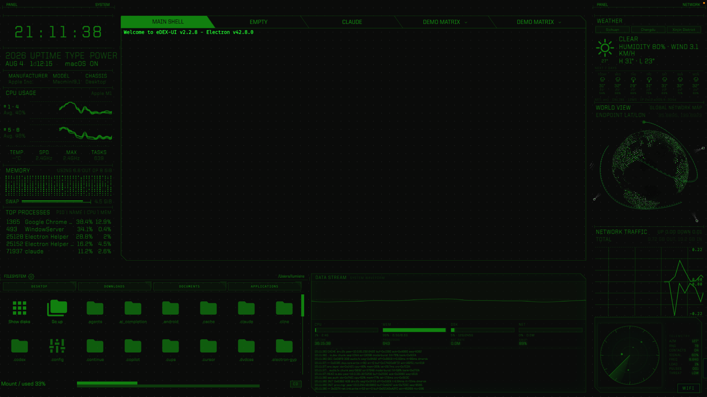

<p align="center">
  
</p>

<p align="center"><strong>Turn a laptop into a sci-fi computer.</strong></p>

<p align="center">
  
  
  
</p>

eDEX-OS is built on a heavily customized [eDEX-UI](https://github.com/GitSquared/edex-ui) (a sci-fi terminal emulator + system monitor) and takes it one step further: **it becomes a real desktop operating system.** It remasters Ubuntu Server 24.04 into an installable ISO — after installation, the laptop **boots straight into the fullscreen eDEX sci-fi interface**, while the Linux underneath stays completely normal: `apt`, `.deb` and AppImage all work as usual.

---

## ✨ Highlights

| Feature | Description |
|---|---|
| **Virtual monitors (tab 4 / 5)** | Native Linux apps (GTK/Qt/AppImage) render *inside* a terminal tab (noVNC streaming); web apps load directly. Switch apps via the ▾ dropdown on the tab label, manually add AppImage paths / commands / URLs, and drive the menu with the keyboard (↑↓ + Enter + Esc). |
| **Native fullscreen** | Hit the fullscreen button and the app takes over the real screen **completely natively** (no more streaming). A subtle `◀ EDEX` button in the corner — or `Ctrl+Shift+Q` — drops you back to eDEX. |
| **Embedded Claude Code (tab 3)** | The 3rd terminal tab is a dedicated Claude Code workspace. |
| **Terminal + system monitoring** | Full-featured terminal emulator (tabs, colors, mouse, `curses`), live CPU/RAM/process/network monitoring, and a directory viewer that follows the terminal's CWD. |
| **Deeply customized modules** | CyberPanel radar, mini music controller, media player, ENCOM-style globe, web-app panel, and a pure-code-drawn sci-fi screensaver / lock screen. |
| **Keyboard-operable UI** | Settings and panels navigate with arrow keys — designed for keyboard / gamepad-first operation. |

## 📸 Screenshots







<details>
<summary>Demo animation</summary>

</details>

---

## 🚀 Quick start (development)

Run from source on macOS / Linux:

```bash
# Install dependencies
npm run install-linux        # or install-darwin / install-windows
# Run
npm start
```

> Without a real Linux box nearby, tabs 4/5 automatically fall back to a built-in **mock backend** (pure-code rendered frames) so the whole pipeline is demo-able with no X server.

## 📦 Building

```bash
# Build the Linux x64 AppImage
npm install
npm run prebuild-linux
./node_modules/.bin/electron-builder build -l --x64

# Build the installable eDEX-OS ISO
#   Option 1: trigger "Build eDEX-OS ISO" manually in GitHub Actions
#   Option 2: on an Ubuntu 24.04 machine
bash packaging/build-iso-local.sh
```

## 💽 Installing on a laptop

1. Download the `eDEX-OS-ISO` artifact from GitHub Actions, or build locally with `build-iso-local.sh`.
2. Flash a USB stick: `dd if=eDEX-OS-*.iso of=/dev/sdX bs=4M status=progress` (or balenaEtcher / Rufus).
3. Boot the laptop from USB and run through the Ubuntu-style installer (pick language / partition / create a user — everything else is automated).
4. Reboot → **auto-login straight into fullscreen eDEX**.

Full install & usage guide: [`packaging/README.md`](packaging/README.md).

## 🗂️ Project layout

```
src/                    # eDEX-UI frontend + Electron main process
  appmonitor/           # Virtual-monitor backend (mock RFB / real Xvfb+x11vnc + noVNC client)
  classes/              # UI modules (incl. appmonitorPanel / webapps / miniAudio ...)
packaging/              # Distro packaging (autoinstall / install scripts / ISO build)
scripts/                # Helper scripts (e.g. app-monitor dependencies)
.github/workflows/      # CI (build AppImage / build eDEX-OS ISO)
```

## 📄 License & credits

- Deeply customized from [eDEX-UI](https://github.com/GitSquared/edex-ui) by Gabriel "Squared" Saillard; licensed under [GPLv3.0](LICENSE).
- noVNC core from [@novnc/novnc](https://github.com/novnc/noVNC) (MPL-2.0, vendored into `src/assets/vendor/novnc`).
- Visual style inspired by *TRON: Legacy*.
